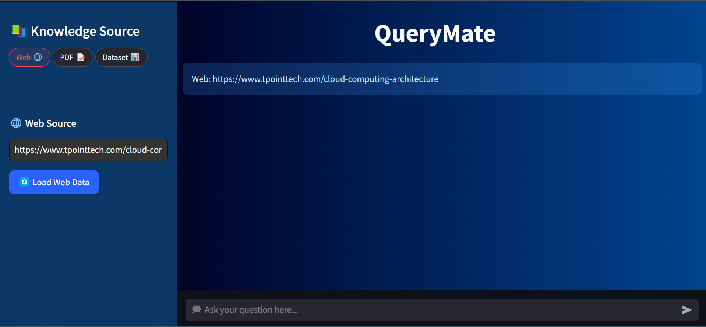

# QueryMate
QueryMate is an AI-powered chatbot designed to extract insights from various knowledge sources, including websites, PDFs, and datasets. It provides users with instant answers, making data exploration and analysis effortless.

## Usage
1. **Select a Knowledge Source**: Choose from Web, PDF, or Dataset in the sidebar.
2. **Provide Input**:
   - Enter a website URL.
   - Upload a PDF document.
   - Upload a dataset (CSV/XLSX).
3. **Process Data**: Click the respective processing button to load and analyze data.
4. **Ask Questions**: Type queries in the chat input box to receive AI-generated insights.

## Screenshots

## Features

#### 🔍 Multi-Source Knowledge Extraction
- **Web Scraping**: Extract insights from websites by providing a URL.
- **PDF Processing**: Upload and analyze PDF documents.
- **Dataset Analysis**: Upload and explore CSV/XLSX datasets.

#### 🚀 Instant Answers
- AI-driven responses for quick and accurate insights.
- Query-based extraction from structured and unstructured data sources.

#### ⚡ User-Friendly Interface
- Simple sidebar selection for knowledge sources.
- Chat-like interface for seamless interaction with the AI assistant.

## Technologies Used
- **Streamlit**: Interactive web interface.
- **Python**: Core programming language.
- **Pandas**: Data manipulation and analysis.
- **BeautifulSoup**: Web scraping (for extracting data from websites).
- **LangChain**: Framework for conversational AI and NLP-based queries.
- **FAISS**: Vector database for efficient semantic search.
